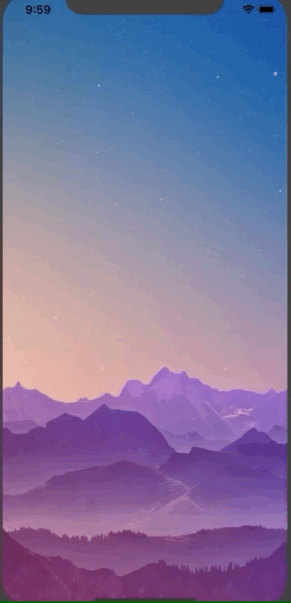

# SideBar

SideBar is a framework for creating an easy to access Safari-like bookmark sidebar

## Design

<br>
Swipe left on any part of the screen to bring out the sidebar and swipe right to dismiss it.

## Instructions

Import SideBar framework and add the following code to get started.

```swift
let mainView = MainView()
self.present(mainView, animated: true, completion: nil)
```
<br>
Add views to mainView like you would to view.
<br>

```swift
let imageView: UIImageView = {
        let imgView = UIImageView()
        return imgView
}()
imageView.snp.makeConstraints { make in
  make.width.equalTo(view)
  make.height.equalTo(view)
}
imageView.image = UIImage(named: "someimage")
mainView.view.addSubview(imageView)
```
